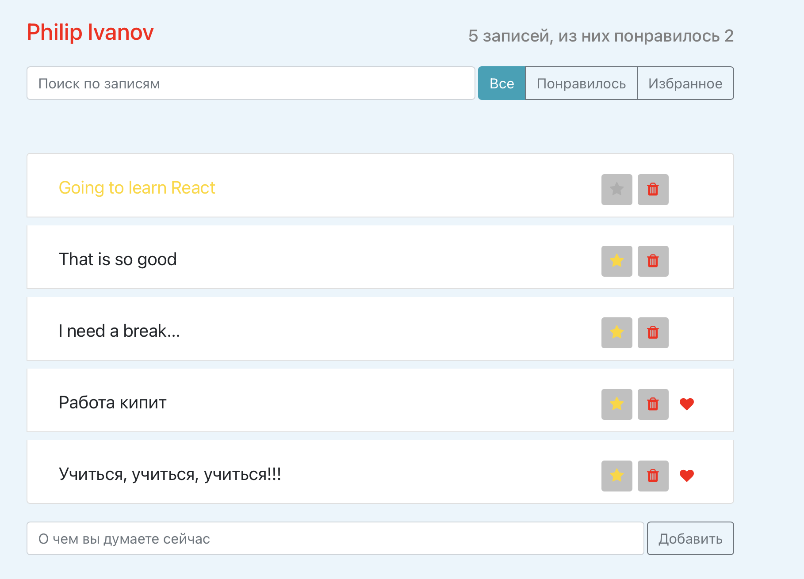

# Тестовое React приложение

Приложение выполнено в рамках курса [Полный курс по JavaScript + React - с нуля до результата](https://www.udemy.com/course/javascript_full/).

Создание данного приложения рассматривается в главе **Библиотека React. Базовый уровень**. 

Дополнительно мною в приложение добавлено:
- Фильтрация по избранным записям (а не только отмеченным 'сердечком');
- Сохранение состояния в localStorage. Таким образом состояние приложение сохраняется даже при перезагрузке страницы

